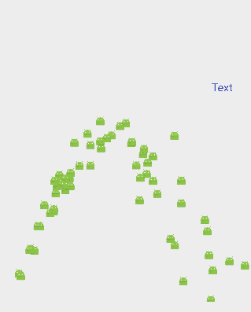

# FPSAnimator
[](https://www.apache.org/licenses/LICENSE-2.0)
[](https://android-arsenal.com/api?level=16)
[](http://androidweekly.net/issues/issue-194)
[](http://android-arsenal.com/details/1/3219)


A simple but powerful Tween / SpriteSheet / ParabolicMotion / animation library for Android TextureView and SurfaceView.

# Features
* The controls Fps possible to animation.
* Possible for animation of Tween and SpriteSheet and ParabolicMotion in one of TextureView.
* Possible to animate with low load on the terminal.
* 28 types of Easing

# Basic Usage
Gradle
```groovy
    dependencies {
        // jCenter
        compile 'com.daasuu:FPSAnimator:0.2.4.0'
    }
```
Include the FPSTextureView widget in your layout. Set FPS by attribute.
Default FPS is 30.<br>
If you use SurfaceView , use FPSSurfaceVIew.
```xml
    <com.daasuu.library.FPSTextureView
        android:id="@+id/animation_texture_view"
        android:layout_width="match_parent"
        android:layout_height="match_parent"
        app:FPSAnimator_fps="24"
        />
```
In your onCreate method (or onCreateView for a fragment), bind the widget.
```JAVA
    private FPSTextureView mFPSTextureView;
    
    @Override
    protected void onCreate(Bundle savedInstanceState) {
        super.onCreate(savedInstanceState);
        setContentView(R.layout.activity_easing_sample);
        mFPSTextureView = (FPSTextureView) findViewById(R.id.animation_texture_view);
    }
```
Create an instance of the DisplayObject, please add it to the FPSTextureView.
```JAVA
    Bitmap bitmap = BitmapFactory.decodeResource(getResources(), R.mipmap.ic_launcher);
    
    DisplayObject bitmapDisplay = new DisplayObject();
    bitmapDisplay
            .with(new BitmapDrawer(bitmap))
            .tween()
            .toX(1600, windowWidth - bitmap.getWidth(), Ease.BACK_IN_OUT)
            .waitTime(1000)
            .alpha(1000, 0f)
            .alpha(1000, 1f)
            .end();
            
    mFPSTextureView
                .addChild(bitmapDisplay)
                .tickStart();
```


The example above will create a new tween instance that:
* tweens the target to an x value of rightSide over 1600ms
* waits 1000 ms
* tweens the target's alpha from  1 to 0 over 1s
* tweens the target's alpha from 0 to 1 over 1s

# Example
This is the implementation of the sample application.

#### SpriteSheet


```JAVA
    
    SpriteSheetDrawer spriteSheetDrawer = new SpriteSheetDrawer(
        spriteBitmapB, 
        frameWidth, 
        frameHeight, 
        frameNum)
        .spriteLoop(true);
    
    DisplayObject displayObject = new DisplayObject();
    displayObject
            .with(spriteSheetDrawer)
            .tween()
            .tweenLoop(true)
            .transform(-frameWidth, windowHeight / 2)
            .toX(3000, windowWidth)
            .end();

    mFPSTextureView
                .addChild(displayObject);
```
[SpriteSheet wiki](https://github.com/MasayukiSuda/FPSAnimator/wiki/SpriteSheet-Animation)

#### TweenText


```JAVA
    Paint paint = new Paint();
    paint.setColor(ContextCompat.getColor(this, R.color.colorAccent));
    paint.setTextSize(Util.convertDpToPixel(16, this));

    String tweenTxt = "TweenText";
    float textWidth = paint.measureText(tweenTxt);
    
    TextDrawer textDrawer = new TextDrawer(tweenTxt, paint)
            .rotateRegistration(textWidth / 2, textWidth / 2);

    DisplayObject textDisplay = new DisplayObject();
    textDisplay.with(textDrawer)
            .tween()
            .tweenLoop(true)
            .transform(0, 800)
            .waitTime(300)
            .to(1000, windowWidth - textWidth, 800, 720f, Ease.SINE_OUT)
            .waitTime(300)
            .to(1000, 0, 800, 0f, Ease.SINE_IN)
            .end();

```

#### TweenBitmap

```JAVA
        BitmapDrawer bitmapDrawer = new BitmapDrawer(bitmap)
            .dpSize(this)
            .scaleRegistration(bitmap.getWidth() / 2, bitmap.getHeight() / 2);

        DisplayObject bitmapDisplay = new DisplayObject();
        bitmapDisplay.with(bitmapDrawer)
                .tween()
                .tweenLoop(true)
                .transform(300, 400)
                .to(500, 300, 400, 0, 6f, 6f, 0, Ease.SINE_IN_OUT)
                .waitTime(300)
                .transform(300, 400, Util.convertAlphaFloatToInt(1f), 1f, 1f, 0)
                .waitTime(300)
                .end();

```
[TweenAnimation wiki](https://github.com/MasayukiSuda/FPSAnimator/wiki/Tween-Animation)

#### ParabolicMotion


```JAVA
    @Override
    protected void onCreate(Bundle savedInstanceState) {
        super.onCreate(savedInstanceState);
        setContentView(R.layout.activity_easing_sample);
        mFPSTextureView = (FPSTextureView) findViewById(R.id.animation_texture_view);
        
        // ParabolicMotionText
        Paint paint = new Paint();
        paint.setColor(ContextCompat.getColor(context, R.color.colorPrimary));
        paint.setTextSize(Util.convertDpToPixel(20, context));
        
        TextDrawer textDrawer = new TextDrawer("Text", paint);
        
        DisplayObject textDisplay = new DisplayObject();
        textDisplay.with(textDrawer)
                .parabolic()
                .transform(800, 800)
                .initialVelocityY(-40)
                .end();

        mFPSTextureView.addChild(textDisplay);
    }

    private void createParabolicMotionBitmap() {
        final DisplayObject bitmapDisplay = new DisplayObject();

        bitmapDisplay.with(new BitmapDrawer(mBitmap).dpSize(context))
                .parabolic()
                .transform(0, mFPSTextureView.getHeight())
                .reboundBottom(false)
                .accelerationX((float) (15 + Math.random() * 7))
                .initialVelocityY((float) (-65 + Math.random() * 15))
                .bottomHitCallback(new AnimCallBack() {
                    @Override
                    public void call() {
                        mFPSTextureView.removeChild(bitmapDisplay);
                    }
                })
                .end();

        mFPSTextureView.addChild(bitmapDisplay);
    }

    @Override
    protected void onResume() {
        super.onResume();
        mFPSTextureView.tickStart();

        mTimer = new Timer();
        mTimer.schedule(new TimerTask() {
            @Override
            public void run() {
                for (int i = 0; i < 5; i++) {
                    createParabolicMotionBitmap();
                }
            }
        }, 0, 100);
    }

```
[ParabolicMotion wiki](https://github.com/MasayukiSuda/FPSAnimator/wiki/ParabolicMotion-Animation)

#### Container
 A Container is a nestable display list that allows you to work with compound display elements.<br>
 For example you could group arm, leg, torso and head Bitmap instances together into a Person Container,
 and transform them as a group, while still being able to move the individual parts relative to each other.
 Children of containers have their transform and alpha properties concatenated with their parent Container.<br>
 Containers have some overhead, so you generally shouldn't create a Container to hold a single child.


# Easing


Applications using FPSAnimator
-------

Please send a pull request if you would like to be added here.

Icon | Application
------------ | -------------
 | [CChannel](https://play.google.com/store/apps/details?id=tv.cchan.harajuku)


Contributers
-------

* [m1noon](https://github.com/m1noon)

## License
    Copyright 2016 MasayukiSuda

    Licensed under the Apache License, Version 2.0 (the "License");
    you may not use this file except in compliance with the License.
    You may obtain a copy of the License at

       http://www.apache.org/licenses/LICENSE-2.0

    Unless required by applicable law or agreed to in writing, software
    distributed under the License is distributed on an "AS IS" BASIS,
    WITHOUT WARRANTIES OR CONDITIONS OF ANY KIND, either express or implied.
    See the License for the specific language governing permissions and
    limitations under the License.
